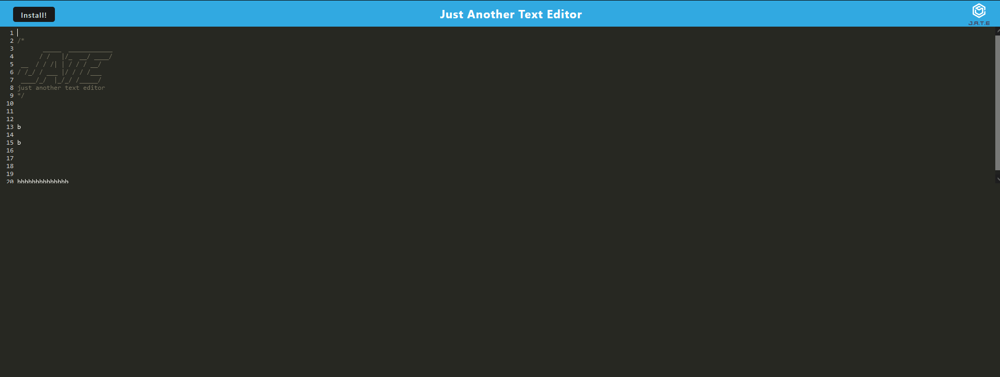

# PWA Text Editor

## Description

In order to learn more about Progressive Web Applications (PWA's), I was provided with an application that needed its implementation. This text editor needed to have multiple different additions in order to function as a PWA, such as CSS and asset caching. I learned much about PWA implementation and functionality.

## Installation

Use `npm i` to install all required modules for all folders

## Usage

Any text you type will be added to your Indexed DB. Click the install button to install as a standalone application.

[Link to Heroku deployment](https://immense-waters-27519-a17e92f539ec.herokuapp.com/)

## Credits

N/A

## License

N/A